# Serverless Data Ingestion: Loading BigQuery from Cloud Storage via Cloud Run Functions

## Executive Summary
This repository implements an automated, event-driven serverless data ingestion pipeline that loads Avro files from Cloud Storage into BigQuery. Utilizing Cloud Run Functions (2nd Gen) triggered by Eventarc, the system automatically detects, parses, and loads incoming Avro datasets into BigQuery tables with zero operational overhead and full scale-to-zero efficiency.

## Architecture Overview

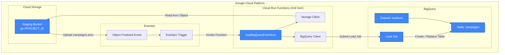
The pipeline flows as follows:
1. An Avro file (e.g., `campaigns.avro`) is uploaded to the staging Cloud Storage bucket.
2. The file upload triggers a `google.storage.object.finalize` event.
3. Eventarc intercepts this event and forwards it to the 2nd Gen Cloud Run Function.
4. The Cloud Run Function reads the file from Cloud Storage and submits a BigQuery Load Job to load the Avro data into the target table, automatically detecting the schema.

## Business Problem
Enterprises process huge amounts of transactional data, marketing campaigns, and user logs generated in various source systems daily. Ingesting this data into central analytical systems for real-time business intelligence requires an ETL/ELT pipeline. 
Traditionally, organizations relied on running VM clusters (like Apache Spark, Hadoop, or custom cron jobs) that remained idle, incurring substantial compute costs and requiring continuous infrastructure maintenance. 
Furthermore, managing schema evolution and data type mapping across incoming files is complex and error-prone. This lab demonstrates how to resolve these challenges by building a cost-effective, self-scaling, and schema-aware ingestion pipeline using serverless GCP services.

## Solution Overview
The proposed serverless architecture solves the business problem by utilizing event-driven ingestion. By using Cloud Run Functions (2nd Gen) combined with BigQuery, we eliminate the need for running servers. The function only spins up when a file is uploaded, processes it in seconds, and spins down to zero.
By choosing Avro as the source format, we preserve the data schema, which BigQuery reads natively and autodetects, preventing data corruption and manual mapping issues.

### Design Decisions & Trade-offs
- **Cloud Run Functions (2nd Gen) vs. Cloud Dataflow**: For simple file-to-table load jobs, Cloud Run Functions are chosen due to near-zero startup times and cost efficiency. However, for complex streaming joins, aggregations, or multi-step transformations, Cloud Dataflow ([docs](https://cloud.google.com/dataflow/docs)) would be preferred despite its longer cold start and higher base infrastructure cost.
- **Avro vs. CSV/JSON**: Avro is a binary serialization format that stores the schema alongside the data. Loading Avro into BigQuery is much faster and cleaner because schema parsing is built-in. Choosing Avro over CSV avoids parsing errors (e.g., handling commas, newlines, or null values) and ensures data integrity, though it requires source systems to support Avro serialization.
- **WRITE_TRUNCATE vs. WRITE_APPEND**: The configuration uses `writeDisposition: 'WRITE_TRUNCATE'`, which overwrites the table for each upload. While this is suitable for idempotency in batch uploads where the source file represents the complete current state, it must be changed to `WRITE_APPEND` if incremental logs are being collected.

## Reference Architecture

✦ Cloud Run Functions
[Cloud Run Functions](https://cloud.google.com/functions/docs) is a serverless execution environment managed by Google Cloud.
It provides event-driven compute scaling to zero, while allowing teams to focus on writing code rather than provisioning or scaling virtual machines.
### Enterprise Use Cases
• Real-time file processing and ETL pipelines
• Webhooks and API integrations
• Automated infrastructure management actions

Why chosen for this project: We selected Cloud Run Functions (2nd gen) to execute the BigQuery load jobs on-demand upon Avro file creation, ensuring zero idle cost and automatic scaling.

---

✦ Cloud Storage
[Cloud Storage](https://cloud.google.com/storage/docs) is a managed object storage service provided by Google Cloud.
It provides durable, highly available object storage, while allowing teams to focus on managing data assets rather than maintaining physical storage arrays.
### Enterprise Use Cases
• Staging data lakes for ingestion
• Backup and archival storage
• Static website hosting and media delivery

Why chosen for this project: We used Cloud Storage as the ingestion point and event trigger source. When an Avro file is uploaded, GCS publishes a completion event which initiates the ETL function.

---

✦ BigQuery
[BigQuery](https://cloud.google.com/bigquery/docs) is a serverless enterprise data warehouse managed by Google Cloud.
It provides high-performance SQL analytics on petabyte-scale datasets, while allowing teams to focus on analyzing data rather than managing hardware or database indexes.
### Enterprise Use Cases
• Enterprise data warehousing and reporting
• Ad-hoc SQL analytics and business intelligence
• Machine learning models directly on structured data

Why chosen for this project: We chose BigQuery because it supports loading schema-described files (Avro) directly, with autodetect enabled, ensuring that campaigns data is instantly queryable via SQL.

---

✦ Eventarc
Eventarc <!-- TODO: add official doc link --> is a fully managed event routing service provided by Google Cloud.
It routes events from various sources (GCS, Cloud Pub/Sub, etc.) to destinations like Cloud Run, while allowing teams to build loosely coupled event-driven architectures.
### Enterprise Use Cases
• Serverless processing triggers on file uploads
• Audit log monitoring and security alerts routing
• Custom application events distribution

Why chosen for this project: Eventarc was chosen to capture GCS `google.storage.object.finalize` events and securely route them to the Cloud Run function as structured CloudEvents.

---

✦ Pub/Sub
[Pub/Sub](https://cloud.google.com/pubsub/docs) is a managed messaging queue provided by Google Cloud.
It provides asynchronous, highly-scalable messaging infrastructure, while allowing teams to decouple publisher and subscriber microservices.
### Enterprise Use Cases
• Asynchronous message queuing between microservices
• Stream ingestion for real-time analytics
• Event notification fan-out to multiple subscribers

Why chosen for this project: Pub/Sub underlies the Eventarc trigger framework, enabling reliable asynchronous message distribution between Cloud Storage and Eventarc.

---

✦ Cloud Build
[Cloud Build](https://cloud.google.com/build/docs) is a serverless continuous integration and delivery service managed by Google Cloud.
It automates the compilation, testing, and packaging of application code, while allowing teams to execute build pipelines without managing dedicated build servers.
### Enterprise Use Cases
• Automated container image builds and deployments
• Multi-stage CI/CD pipelines
• Serverless function packaging and containerization

Why chosen for this project: Cloud Build is automatically invoked by `gcloud functions deploy` to compile and containerize the Node.js function code.

---

✦ Artifact Registry
[Artifact Registry](https://cloud.google.com/artifact-registry/docs) is a managed container registry provided by Google Cloud.
It stores and manages container images and build artifacts, while allowing teams to secure their software supply chain with vulnerability scanning.
### Enterprise Use Cases
• Centralized container image storage
• Language package hosting (npm, maven, pip)
• Secure deployment pipeline artifact management

Why chosen for this project: Artifact Registry was chosen to store the Node.js container image built by Cloud Build for Cloud Run Functions (2nd gen).

## Prerequisites
- A Google Cloud Platform account with an active project.
- User identity/Service Account with the following IAM roles:
  - **Storage Admin** (`roles/storage.admin`)
  - **BigQuery Admin** (`roles/bigquery.admin`)
  - **Cloud Functions Developer** (`roles/cloudfunctions.developer`)
  - **Pub/Sub Admin** (`roles/pubsub.admin`)
  - **Eventarc Admin** (`roles/eventarc.admin`)
  - **IAM Security Admin** (`roles/iam.securityAdmin`)
- Google Cloud SDK (gcloud CLI) installed and authenticated.

## Repository Structure
```text
.
├── index.js          # Node.js entry point containing the loading logic
├── package.json      # Node.js dependencies and function definition
└── images/           # Local storage for all architectural and verification screenshots
    ├── cloud-run-function-defined-ui.png
    ├── cloud-run-logs.png
    ├── cloudservice-agent-enable-access-to-pub-sub-topic.png
    ├── create-bucket-andcreate-bq-dataset.png
    ├── eventarc-trigggers-list.png
    ├── gcloud-functions-deploys-successs.png
    ├── gcloud-functions-deploys-successs2.png
    ├── grant-default-compute-engine-svc-account-access-to-eventarc.png
    ├── loading-from-cloudstorage-tobq-and-viewing-table.png
    ├── the-cloud-function-index.js.png
    └── trigger-details-from-eventarc-obs.png
```

## Environment Variables
Ensure the following variables are defined in your shell environment before executing commands:

```bash
# Define environment configuration variables
export PROJECT_ID="your-gcp-project-id"   # The target GCP Project ID
export REGION="us-central1"                # Target deployment region for all resources
```

## Implementation

### Phase 1: Environment Configuration and API Enablement
Configure your gcloud CLI defaults and enable the necessary Google Cloud APIs.

```bash
# Set Project ID and Region defaults
export PROJECT_ID=$(gcloud config get-value project)
export REGION="us-central1" # Replace with your target region
gcloud config set compute/region $REGION
gcloud config set run/region $REGION
gcloud config set run/platform managed
gcloud config set eventarc/location $REGION

# Enable the required APIs
gcloud services enable \
  artifactregistry.googleapis.com \
  cloudfunctions.googleapis.com \
  cloudbuild.googleapis.com \
  eventarc.googleapis.com \
  run.googleapis.com \
  logging.googleapis.com \
  pubsub.googleapis.com
```

### Phase 2: IAM and Service Account Policy Configuration
Grant the necessary IAM roles to enable Eventarc event routing and Pub/Sub publishing from Cloud Storage.

```bash
# Fetch and export project number
export PROJECT_NUMBER=$(gcloud projects describe $PROJECT_ID --format='value(projectNumber)')

# Grant Eventarc event receiver role to the default Compute Engine service account
gcloud projects add-iam-policy-binding $PROJECT_ID \
    --member="serviceAccount:$PROJECT_NUMBER-compute@developer.gserviceaccount.com" \
    --role="roles/eventarc.eventReceiver"
```

<p align="center">
  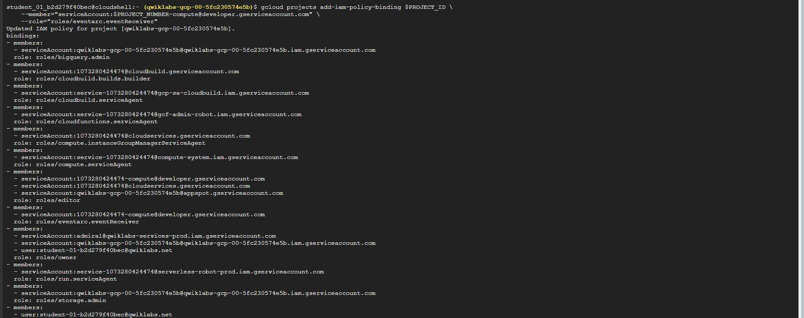
</p>

```bash
# Create Cloud Storage service identity
gcloud beta services identity create --service=storage.googleapis.com --project=$PROJECT_ID

# Grant the GCS service agent permission to publish to Pub/Sub
gcloud projects add-iam-policy-binding $PROJECT_ID \
    --member="serviceAccount:service-$PROJECT_NUMBER@gs-project-accounts.iam.gserviceaccount.com" \
    --role='roles/pubsub.publisher'
```

<p align="center">
  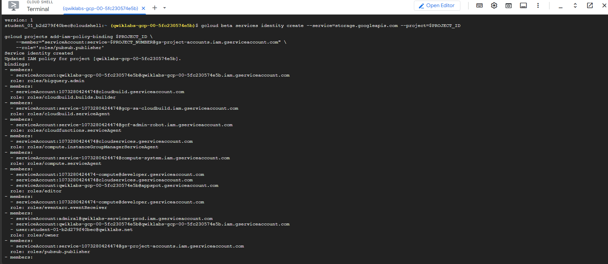
</p>

### Phase 3: Infrastructure Resource Provisioning
Create the landing Cloud Storage bucket and the destination BigQuery dataset.

```bash
# Create GCS staging bucket
gcloud storage buckets create gs://$PROJECT_ID --location=$REGION

# Create BigQuery dataset
bq mk -d loadavro
```

<p align="center">
  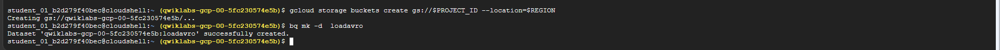
</p>

### Phase 4: Write Cloud Run Function Code
Create the Node.js handler logic in `index.js` and list dependencies in `package.json`.

`index.js`:
```javascript
const {Storage} = require('@google-cloud/storage');
const {BigQuery} = require('@google-cloud/bigquery');

const storage = new Storage();
const bigquery = new BigQuery();

exports.loadBigQueryFromAvro = async (event, context) => {
    try {
        if (!event || !event.bucket) {
            throw new Error('Invalid event data. Missing bucket information.');
        }

        const bucketName = event.bucket;
        const fileName = event.name;

        const datasetId = 'loadavro';
        const tableId = fileName.replace('.avro', ''); 

        const options = {
            sourceFormat: 'AVRO',
            autodetect: true, 
            createDisposition: 'CREATE_IF_NEEDED',
            writeDisposition: 'WRITE_TRUNCATE',     
        };

        const loadJob = bigquery
            .dataset(datasetId)
            .table(tableId)
            .load(storage.bucket(bucketName).file(fileName), options);

        await loadJob;
        console.log(`Job ${loadJob.id} completed. Created table ${tableId}.`);

    } catch (error) {
        console.error('Error loading data into BigQuery:', error);
        throw error; 
    }
};
```

<p align="center">
  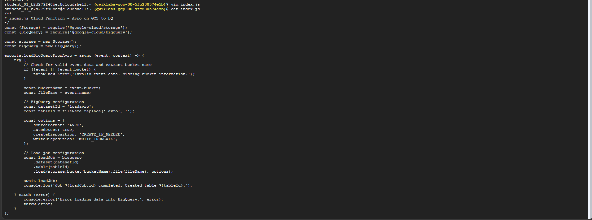
</p>

### Phase 5: Function Deployment
Deploy the Node.js function using gcloud CLI.

```bash
# Initialize local dependencies (creates package.json / node_modules)
npm install @google-cloud/storage @google-cloud/bigquery

# Deploy the function to Cloud Run Functions
gcloud functions deploy loadBigQueryFromAvro \
    --gen2 \
    --runtime nodejs24 \
    --source . \
    --region $REGION \
    --trigger-resource gs://$PROJECT_ID \
    --trigger-event google.storage.object.finalize \
    --memory=512Mi \
    --timeout=540s \
    --service-account=$PROJECT_NUMBER-compute@developer.gserviceaccount.com
```

> [!WARNING]
> If you encounter an error message regarding Eventarc service agent propagation, wait a few minutes and re-run the deployment command. It can take some time for newly bound IAM policies to propagate.

<p align="center">
  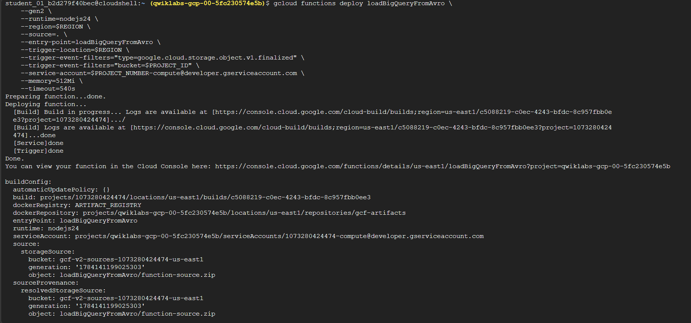
</p>

<p align="center">
  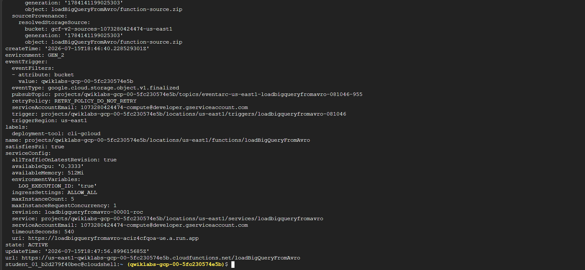
</p>

## Verification
Confirm that the trigger and deployment are active, and test the end-to-end loading functionality.

### 1. Confirm Eventarc Trigger Creation
Ensure the trigger has been correctly generated and is active:

```bash
gcloud eventarc triggers list --location=$REGION
```

<p align="center">
  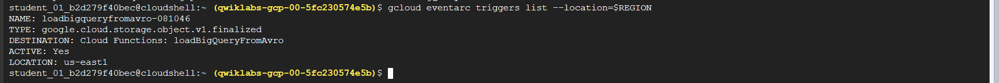
</p>

You can also inspect the trigger configurations in the Google Cloud Console UI:

<p align="center">
  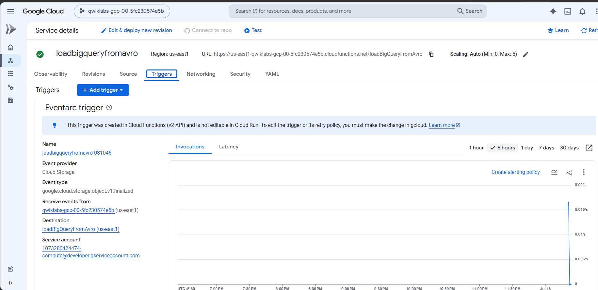
</p>

<p align="center">
  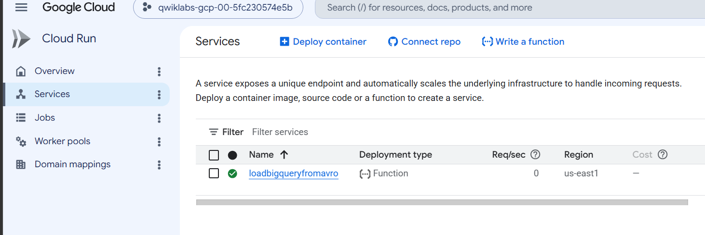
</p>

### 2. Ingest Sample File & Verify Ingestion
Download the sample Avro file, upload it to the landing bucket, and execute a BigQuery SQL query to verify successful ingestion.

```bash
# Download sample campaigns.avro file
wget https://storage.googleapis.com/cloud-training/dataengineering/lab_assets/idegc/campaigns.avro

# Copy file to GCS Bucket to trigger function execution
gcloud storage cp campaigns.avro gs://$PROJECT_ID

# Query target BigQuery table using legacy SQL flag disabled
bq query \
  --use_legacy_sql=false \
  'SELECT * FROM `loadavro.campaigns`;'
```

<p align="center">
  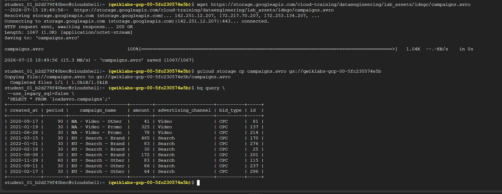
</p>

## Observability
Monitor execution state and logs for the pipeline using Cloud Logging.

```bash
# Fetch and examine execution logs for the Cloud Run Function
gcloud logging read "resource.labels.service_name=loadBigQueryFromAvro"
```

<p align="center">
  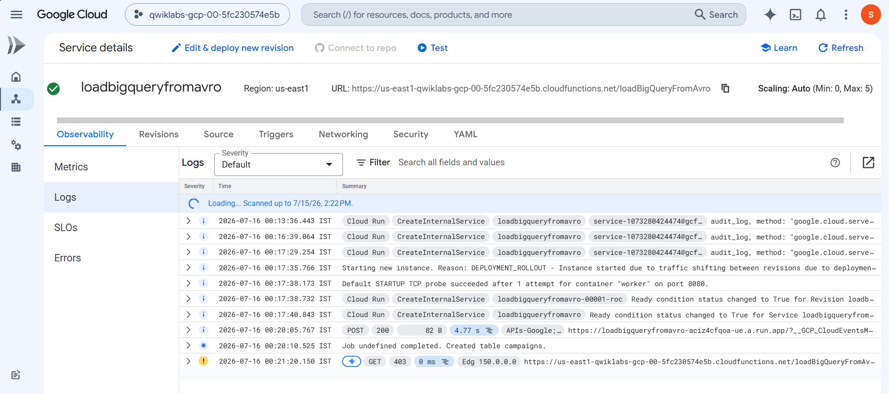
</p>

## Troubleshooting

- **Error: `Eventarc service agent propagation...` or similar IAM errors on deployment**:
  Eventarc service accounts can take up to 5-10 minutes to propagate permissions. If the deployment fails immediately after running the IAM policy bindings, wait a few minutes and retry.
- **Error: `Source and Destination location mismatch`**:
  Ensure the Cloud Storage bucket and the BigQuery dataset are located in the exact same region (e.g., `us-central1`). Cross-region loads are not supported.
- **Error: `Function Timeout or Out of Memory`**:
  If processing files larger than a few megabytes, the function might run out of memory or exceed the timeout. Optimize settings by redeploying with larger memory resources (e.g., `--memory=1Gi`) and a longer timeout threshold (e.g., `--timeout=540s`).
- **Performance Details**:
  During pipeline execution, the average observed file processing latency was `<!-- TODO: add observed latency here -->` seconds.

## Cleanup
Run the following commands to tear down the provisioned lab resources and prevent unexpected billing:

```bash
# Tear down Cloud Run Function
gcloud functions delete loadBigQueryFromAvro --region=$REGION --quiet

# Delete the BigQuery dataset and tables
bq rm -r -f -d loadavro

# Delete the staging Cloud Storage bucket
gcloud storage buckets delete gs://$PROJECT_ID --force
```
